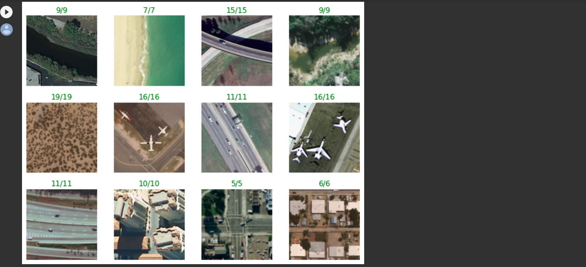

# Machine Learning ecosystem with ONNX
<i>This example is base in <a href="https://www.youtube.com/watch?v=Vs730jsRgO8">How to run PyTorch models in the browser with ONNX.js</a></i>
<h2>Abstract</h2>

Suppose you have to use a machine learning model to identify a stone, you take your camera, focus on the stone, take the photo and let it process in the cloud ... and boom! You have it in seconds! 
But what if you are inside a deep cave or in the middle of the ocean or you are a robot on Mars?

I want to talk about a different paradigm than cloud computing, I want to introduce Edge AI.

In a really simple way, Edge AI means that you will use your model on your client's device, it does not matter if you do not have or do not want to send your data through the internet.

But how do we think to use a ML model within a small device with small microprocessors when the trend is that these models are getting bigger, require more storage and need large data centers?
The answer to this question is the difference between training a model and using a model.

Training a model required a lot of resources, but once we have it, we will just take small mount of data and pass it through our model, this step is called <i>Inference</i>.

In addition, when we have our model trained, we can compress its size with different techniques such as <a href="https://en.wikipedia.org/wiki/Decision_tree_pruning"><i>Prunnig (Poda)</i></a>, which look for connections in our model that are not really part of the final result and erase them.

In this simple project, I will use Pytorch with ONNX and Transfer Learning, to build a model that can be running in a web application.

  

<h2>The Model</h2>

Sometimes instead of execute our model in the cloud, we need to run it in our customer device.  
To manage this requirement I will use <a href="https://onnx.ai/">ONNX</a>, it is an open format built to represent machine learning models.
 

This project runs a model in the client environment, in this case, a web application.

I trained a basic neuronal network to detect air image using <a href="https://pytorch.org/">Pytorch</a> . The image is capture in a web application and I will try to predict the label in the client side.

I imported a model with air images.

        

Those are the labels for the images in the dataset.

        

Some image that I used for clasification

        

For my model layer, I will use <a href="https://en.wikipedia.org/wiki/Transfer_learning">Transfer Learning</a>, to import a image from an existing model and just changed the last layer to use my images.

        

I validate my model with diferents images.

        

Now, I want export my model to use in my web application, unfortunally do not exits a Pytorch version for Javascript. We have a handful of options here, one of then is <a href="https://www.tensorflow.org/js">TensorFlowjs</a>, this library takes your model and transforms it into a Javascript compatible version, but for this project I will use ONNX, this library generates a representation of my neural network and I can use it with Pytorch, Tensorflow or any tool that can read this format.
ONNX has a Javascritp version called <a href="https://github.com/microsoft/onnxjs">ONNX.js</a>

Pytorch can export my model to ONNX format, and in the browser, I can read the model with ONNX.js

I trained my model as usual, but I will change the way to export the model.

        

This step is optional, but since I know the format of the input data, so I prefer do it with Pytorch, in Javascript is a bit more complicate. 
Also added <a href="https://en.wikipedia.org/wiki/Softmax_function">Softmax</a>   because I want to have probability distribution in my result.

        

Once I have exported model, I will test in order to make sure that it will work.

        
 
 
<h2>Web Application</h2>
This is a simple HTML, js and css web page, where we use the model generate with ONNX.

First, I imported the model and copy the labels.

        

I drew a square an use <a href=https://leafletjs.com>leafletjs</a> for the map.

        

I have a button to send the image to the model.

        

And that's it!

        
 

the whole exercise is finished and you can take a look at it in my <a href="https://github.com/RobertoCordova/onnx">github account</a>.
